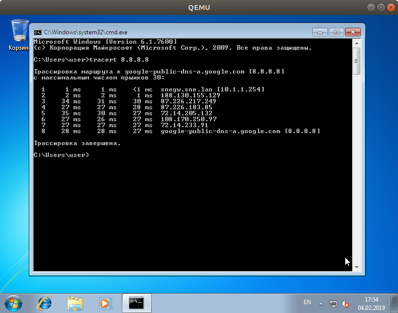

# Preface

# Task 1. KVM & Raspberry PI 3B+

## Install ArchLinux

- [Raspberry Pi 3 | Arch Linux ARM](https://archlinuxarm.org/platforms/armv8/broadcom/raspberry-pi-3)

### Preparing MicroSD card

*We are installing on Samsung MicroSD 32GB*

```
fdisk /dev/sdb
> o
> n [new] -> p [primary] -> ENTER [1st part] -> ENTER [start sector = 2048] -> +100M
> t [type] -> c ['Linux' -> 'W95 FAT32 (LBA)']
> n -> p -> ENTER -> ENTER
> w
```

```
mkfs.vfat /dev/sdb1
mkdir boot
mount /dev/sdb1 boot/

mkfs.ext4 /dev/sdb2
mkdir root
mount /dev/sdb2 root

wget http://de3.mirror.archlinuxarm.org/os/ArchLinuxARM-rpi-3-latest.tar.gz{,.md5}
md5sum -c ArchLinuxARM-rpi-3-latest.tar.gz.md5
bsdtar -xpf ArchLinuxARM-rpi-2-latest.tar.gz -C root
sync && sync && sync

mv root/boot/* boot
sync && sync && sync

umount boot root
```

### Configuring system

- basic users and network status

```
# passwd
# userdel alarm
# rm -r /home/alarm

systemctl status systemd-networkd
systemctl status systemd-resolved
resolvectl status
```

- enable DNSSEC

```
mkdir /etc/systemd/resolved.conf.d
cat /etc/systemd/resolved.conf.d/dnssec.conf
> [Resolve]
> DNSSEC=true

systemctl restart systemd-resolved && resolvectl status
resolvectl query sigfail.verteiltesysteme.net
> sigfail.verteiltesysteme.net: resolve call failed: DNSSEC validation failed: invalid
```

- enroll archlinux keys and check if the validation is enabled (see [archlinuxarm](https://archlinuxarm.org/about/package-signing))

```
systemctl status haveged
pacman-key --init
pacman -S archlinuxarm-keyring
> ...
>  -> Locally signing key 69DD6C8FD314223E14362848BF7EEF7A9C6B5765...
>  -> Locally signing key 02922214DE8981D14DC2ACABBC704E86B823CD25...
>  -> Locally signing key 9D22B7BB678DC056B1F7723CB55C5315DCD9EE1A...
> ...
pacman-key --populate archlinuxarm
vi /etc/pacman.conf
> ...
> SigLevel    = Required DatabaseOptional
> LocalFileSigLevel = Optional
> ...
```

- set network

```
hostnamectl set-hostname laputa

cat /etc/systemd/network/eth.network
> [Match]
> Name=eth0
>
> [Network]
> Address=192.168.16.242/24
> Gateway=192.168.16.1
> DNS=8.8.8.8
systemctl restart systemd-networkd && ip addr
```

- set SSH and also import public keys

```
cat /etc/ssh/sshd_config
> Port 22922
> PasswordAuthentication no
```

- Install convenient packages

```
packman -S vim bash-completion
```

## Installing QEMU/KVM

```
pacman -Sy
pacman -S qemu-headless
```

## Creating Debian guest

```
mkdir -p distros/debian && cd distros/debian
wget https://cdimage.debian.org/debian-cd/current/arm64/iso-cd/\
                                                debian-9.7.0-arm64-netinst.iso \
     https://cdimage.debian.org/debian-cd/current/arm64/iso-cd/SHA256SUMS

qemu-img create -f qcow debianhdd.qcow 1G
```

## Getting in troubles

Then, I've tried to run a machine and install Debian distro, but I couldn't figure out
how to run it with `qemu` correctly, so next there will be my tries and results.
Maybe, someday I'll be enlightened and return to this moment, but to finish the lab
I will just utilize the Qemu/KVM, which has been installed on the workstation
since Ubuntu Desktop installation.

- Try to run with CD-first option

```
[root@laputa debian]# qemu-system-aarch64 -M virt -cpu cortex-a57 \
            -drive file=./debianhdd.qcow,if=virtio,format=qcow \
            -drive if=virtio,format=raw,file=debian-9.7.0-arm64-netinst.iso
            -m 100M \
            -boot once=d \
            -monitor telnet::45454,server \
            -vnc 0.0.0.0:5555

suhoy@think-neet:~$ telnet 192.168.16.242 45454

> qemu-system-aarch64: \
  no function defined to set boot device list for this architecture
```

- Try to do it with a boot menu:

```
[root@laputa debian]# qemu-system-aarch64 ... -boot menu=on
suhoy@think-neet:~$ telnet 192.168.16.242 45454
```

In the VNC there is no boot menu:


Another unclear moment is that I could not understand whether `kvm` is working or
not.

On the one side there is some parameters in kernel and also `/dev/kvm`-file:

```
[root@laputa ~]# zgrep CONFIG_KVM /proc/config.gz
CONFIG_KVM_MMIO=y
CONFIG_KVM_VFIO=y
CONFIG_KVM_GENERIC_DIRTYLOG_READ_PROTECT=y
CONFIG_KVM=y
CONFIG_KVM_ARM_HOST=y
CONFIG_KVM_ARM_PMU=y
CONFIG_KVM_INDIRECT_VECTORS=y

[root@laputa debian]# ls -l /dev/kvm
crw-rw-rw- 1 root kvm 10, 232 Feb  3 13:50 /dev/kvm
```

On the other side there is no kvm-related linux-modules and nothing about HVM in the CPU-info:

```
[root@laputa ~]# lsmod | grep kvm
[root@laputa debian]# cat /proc/cpuinfo
processor    : 0
BogoMIPS    : 38.40
Features    : fp asimd evtstrm crc32 cpuid
CPU implementer    : 0x41
CPU architecture: 8
CPU variant    : 0x0
CPU part    : 0xd03
CPU revision    : 4
... 4 times ...

[root@laputa debian]# lscpu
Architecture:        aarch64
Byte Order:          Little Endian
CPU(s):              4
On-line CPU(s) list: 0-3
Thread(s) per core:  1
Core(s) per socket:  4
Socket(s):           1
Vendor ID:           ARM
Model:               4
Model name:          Cortex-A53
Stepping:            r0p4
BogoMIPS:            38.40
Flags:               fp asimd evtstrm crc32 cpuid
```

Next check stage is `QEMU`. We can check if kvm is running in the monitor:

```
[root@laputa debian]# qemu-system-aarch64 -M virt -cpu cortex-a57 \
        -drive file=./debianhdd.qcow,if=virtio,format=qcow \
        -drive if=virtio,format=raw,file=debian-9.7.0-arm64-netinst.iso \
        -m 100M -boot menu=on \
        -monitor telnet::45454,server \
        -vnc 0.0.0.0:0

suhoy@think-neet:~$ telnet 192.168.16.242 45454
...
(qemu) info kvm
kvm support: disabled
```

Try enable kvm in the `qemu`:
```
[root@laputa debian]# qemu-system-aarch64 ... -enable-kvm
suhoy@think-neet:~$ telnet 192.168.16.242 45454

... [root@laputa debian] ...
qemu-system-aarch64: kvm_init_vcpu failed: Invalid argument
```

## Home sweet ~~home~~ Ubuntu Desktop 18.04.1 LTS

There is no installation because it has been installed. Thus just check
the installed packages:

```
suhoy@quark:~$ dpkg --list | grep -E "kvm|qemu|virt"
```

| Package | Description |
|-----------------------------------|--------------------------------------------------------------|
| gir1.2-libvirt-glib-1.0:amd64     | GObject introspection files for the libvirt-glib library|
| ipxe-qemu                         | PXE boot firmware - ROM images for qemu|
| ipxe-qemu-256k-compat-efi-roms    | PXE boot firmware - Compat EFI ROM images for qemu|
| libvirt-clients                   | Programs for the libvirt library|
| libvirt-daemon                    | Virtualization daemon|
| libvirt-daemon-driver-storage-rbd | Virtualization daemon RBD storage driver|
| libvirt-daemon-system             | Libvirt daemon configuration files|
| libvirt-glib-1.0-0:amd64          | libvirt GLib and GObject mapping library|
| libvirt0:amd64                    | library for interfacing with different virtualization systems|
| ovmf                              | UEFI firmware for 64-bit x86 virtual machines|
| python-libvirt                    | libvirt Python bindings|
| qemu                              | fast processor emulator|
| qemu-block-extra:amd64            | extra block backend modules for qemu-system and qemu-utils|
| qemu-kvm                          | QEMU Full virtualization on x86 hardware|
| qemu-slof                         | Slimline Open Firmware -- QEMU PowerPC version|
| qemu-system                       | QEMU full system emulation binaries|
| qemu-system-arm                   | QEMU full system emulation binaries (arm)|
| qemu-system-common                | QEMU full system emulation binaries (common files)|
| qemu-system-mips                  | QEMU full system emulation binaries (mips)|
| qemu-system-misc                  | QEMU full system emulation binaries (miscellaneous)|
| qemu-system-ppc                   | QEMU full system emulation binaries (ppc)|
| qemu-system-s390x                 | QEMU full system emulation binaries (s390x)|
| qemu-system-sparc                 | QEMU full system emulation binaries (sparc)|
| qemu-system-x86                   | QEMU full system emulation binaries (x86)|
| qemu-user                         | QEMU user mode emulation binaries|
| qemu-user-binfmt                  | QEMU user mode binfmt registration for qemu-user|
| qemu-utils                        | QEMU utilities|
| virt-manager                      | desktop application for managing virtual machines|
| virt-viewer                       | Displaying the graphical console of a virtual machine|
| virtinst                          | Programs to create and clone virtual machines|

There is a lot of packages. To not get into the same case as in Arch, let's try understand
the general relations between them:

 - [KVM (Kernel-based Virtual Machine)](https://www.linux-kvm.org/page/Main_Page) - the
 [hardware-assisted virtualization](https://en.wikipedia.org/wiki/Hardware-assisted_virtualization),
 which means that it uses hardware virtualization extension (
 [Intel VT](https://en.wikipedia.org/wiki/X86_virtualization#Intel_virtualization_(VT-x)) or
 [AMD-V](https://en.wikipedia.org/wiki/X86_virtualization#AMD_virtualization_(AMD-V)) a.k.a.
 [x86 virtualization](https://en.wikipedia.org/wiki/X86_virtualization) in general).
 it is embodied in `kvm.ko` + `kvm-intel.ko` or `kvm-amd.ko` modules.
 - [QEMU](https://www.qemu.org/) - emulator and virtualizer. In the virtualizer mode
 it can use either KVM either XEN and reach close-hardware performance. **Ambiguity:**
 there is `kvm`-command in the bash, but it is just wrapper around QEMU (`qemu-system-x86_64 -enable-kvm`, **man kvm**).
 - [libvirt](https://libvirt.org/index.html) - the API for virtualization which pass control to one of the
 [drivers](https://libvirt.org/drivers.html). It might be LXC, QEMU, VirtualBox, Xen, Hyper-V, VMware, ... While we are
 evaluating KVM and its managers there's no special reason to use it, only eventualy. The `virsh` is like `shell`-embodiment
 of that API, its [reference](https://libvirt.org/virshcmdref.html) is poor, good point for next Hacktoberfest.
 - [virt-manager](https://virt-manager.org/) - GUI manager to targets KVM through libvirt.
 Also, it can manage Xen and LXC. It has supporting tools: `virt-install`, `virt-viewer`,
 `virt-clone`, `virt-ml`, `virt-convert`.

### Check KVM

```
cat /proc/cpuinfo | grep svm # for AMD-V
cat /proc/cpuinfo | grep vmx # for Intel VT
flags           : ... vmx ...
...

suhoy@quark:~$ lsmod  | grep kvm
kvm_intel             212992  0
kvm                   598016  1 kvm_intel
irqbypass              16384  1 kvm

suhoy@quark:~$ kvm-ok
INFO: /dev/kvm exists
KVM acceleration can be used
```

### Understand the QEMU Networking

As we have found, there is no reason to use `libvirt`, so currently, we can
skip these guides ([1](https://wiki.libvirt.org/page/Networking),
[2](https://help.ubuntu.com/community/KVM/Networking),
[3](https://jamielinux.com/docs/libvirt-networking-handbook/index.html))
about libvirt networking and should concentrate on
[QEMU-networking](https://wiki.qemu.org/Documentation/Networking).

In the lab description there is such requirement:

>  bridge so your guests can reach the SNE LAN directly

So, we will try to run QEMU machine with KVM, which is able to retrieve
IP from 10.1.1.0/24 via DHCP. Or at least set static address `10.1.1.42`
and reach the Internet over `10.1.1.254`-gateway.

QEMU basic: **network device** and **network backend**.

- to create network backend: `-netdev TYPE,id=NAME,...`, TYPE: `user` (SLIRP), `tap`, `vde`, `socket`
- to create network device: `-device TYPE,netdev=NAME`, TYPE: `e1000` (default in qemu),
`rtl8139` (default in qemu-kvm), `virtio-net` (para-virtualised, is the best performance)
- `-nic` is just the shorthand:

```
-netdev user,id=n1 -device virtio-net-pci,netdev=n1
-nic user,model=virtio-net-pci
```

how to dump network traffic:

```
-object filter-dump,id=f1,netdev=u1,file=dump.dat
```

- `-netdev`-options: `hostfwd=tcp::5555-:22` - port forwarding,


Finally, I've found the hint how to combine above function to connect VM with SNE-lan
([gist](https://gist.github.com/extremecoders-re/e8fd8a67a515fee0c873dcafc81d811c)).

### Bridging the networks

```bash
brctl addbr br0-kvm # ip link add br0 type bridge
ip addr flush eno1 # ip link set eth0 master br0
brctl addif br0-kvm eno1
tunctl -t tap0-kvm -u suhoy
brctl addif br0-kvm tap0-kvm
brctl show
> bridge name   bridge id      STP enabled  interfaces
> br0-kvm       8000.8613cfea76d1   no      eno1
>                                           tap0-kvm
> virbr0        8000.525400baca8f   yes     virbr0-nic
```

### Run with bridged network

- generate MAC address and use the created tap-interface as backend:

```bash
./scripts/gen-mac-addr.sh
> 02:c2:03:bc:48:6f

sudo kvm ... \
    -netdev tap,id=ubuntu-server,ifname=tap0-kvm,script=no \
    -device virtio-net,netdev=ubuntu-server,mac=02:c2:03:bc:48:6f
```

## Checkout the images

Targets: Linux [Kali|Ubuntu|Arch], Windows 7, OpenBSD, ReactOS

```
$ ls ~/VM/iso/
archlinux-2018.11.01-x86_64.iso
ubuntu-18.04.1-desktop-amd64.iso
ubuntu-18.04.1-live-server-amd64.iso
kali-linux-2018.1-amd64.iso
windows7.iso
ReactOS-0.4.10.iso

$ file install64.iso
install64.iso: ISO 9660 CD-ROM filesystem data 'OpenBSD/amd64   6.4 Install CD' (bootable)
```

## Installing the OS-es

All installations are similar and the commands will repeat each launch, so
there is the reason to script starting command. Here is the only reference to these
scripts and little comment for main points. Details can be found in the source.

- `./scripts/ubuntu-server.sh` - the first script, used for debugging.
- `./scripts/windows7.sh` - system not recognize hard drive and network card with `virtio`-type. So I put default hard-drive, and `e1000`-network device.
- `./scripts/openbsd.sh` - unsucessfuly tried install over serial console without graphic.
- `./scripts/reactos.sh` - the same problem as in win7. But even `e1000` was not recognized.
The random suggestion from the Internet to use `ne2k_pci` has helped.





## Reaching the Quest over SSH

Tries to set IP on the `eno1` (hardware part of the bridge) was unsuccessful.
Set IP to the bridge works:


## Paravirtualization

[KVM paravirtualization](https://www.linux-kvm.org/page/Virtio) is reached by using
special devices. There are `virtio` in `-drive`, and `virtio-net` in `-device`. As
soon as distribution has the drivers it will work from the box. In my cases `ubuntu-server`
and `openbsd` has the `virtio` devices.

We can check that support in the Ubuntu server if find the kernel config file:


## Disabling the console

I tried to run installation over the serial port, but could not perform the installation.
But there is still a chance: during installation, OpenBSD suggest create the default
console to `com0`. So we can install OpenBSD with VNC-default way, and then disable
graphic and enable the serial port:

```bash
# ./scripts/openbsd-nographic.sh
# ...
    -nographic \
    -serial telnet::5555,server \
```

In that command serial port was redirected to `:5555`-telnet port.


# Task 2. KVM nested Bhyve

## Adventure time

In the old-lab description, there is an option to try `bhyve`. I had already been
ready to install FreeBSD to the host, but I found the intriguing question
on the bhyve [wiki](https://wiki.freebsd.org/bhyve):

> Q: Can I run multiple bhyve hosts under Linux KVM with nested VT-x EPT?
>
> A: Maybe. You must enable it and note the known limitations. Please let us know if you are successful.

With references about KVM-nested virtualization ([1](http://www.rdoxenham.com/?p=275),
 [2](https://www.kernel.org/doc/Documentation/virtual/kvm/nested-vmx.txt)).

So, check the nested KVM option:


```
qemu-system-x86_64 -cpu help | grep vmx
> pni pclmulqdq dtes64 monitor ds-cpl vmx smx est tm2 ssse3 cid fma cx16 xtpr \
 pdcm pcid dca sse4.1 sse4.2 x2apic movbe popcnt tsc-deadline aes xsave osxsave \
 avx f16c rdrand hypervisor
```

## Install Frebsd into kvm with nested

- QEMU script: `scripts/freebsd.sh`


### Preparing the FreeBSD host

I'm following the chapter [21.7. FreeBSD as a Host with bhyve](https://www.freebsd.org/doc/handbook/virtualization-host-bhyve.html) in the FreeBSD handbook.

Load the virtualization:
```
kldload vmm
```
There was some message about a bug, but I forgot to catch it. On the next loading
the system says that this module is loaded, so we are continuing:

```
kldload vmm
kldload: can't load vmm: module already loaded or in kernel
```

- configuring bridge:

```
# ifconfig tap0 create
# sysctl net.link.tap.up_on_open=1
net.link.tap.up_on_open: 0 -> 1
# ifconfig bridge0 create
# ifconfig bridge0 addm igb0 addm tap0
# ifconfig bridge0 up
```

### Creating a FreeBSD Guest

```
truncate -s 10G guest.img

fetch ftp://ftp.freebsd.org/pub/FreeBSD/releases/ISO-IMAGES/10.3/\
    FreeBSD-10.3-RELEASE-amd64-bootonly.iso
sh /usr/share/examples/bhyve/vmrun.sh -c 1 -m 1024M -t tap0 -d guest.img \
    -i -I FreeBSD-10.3-RELEASE-amd64-bootonly.iso freebsd

sh /usr/share/examples/bhyve/vmrun.sh -c 4 -m 1024M -t tap0 -d guest.img freebsd
```


### Creating a Linux Guest

#### Ubuntu Server

We will override installed nested FreeBSD image, beacause there is only `15G` in the
FreeBSD system.

```
scp ubuntu-18.04.1-live-server-amd64.iso root@10.1.1.42:/root/

pkg install sysutils/grub2-bhyve vim-console

root@fuva-fuva:~ # cat device.map
(hd0) ./guest.img
(cd0) ./ubuntu-18.04.1-live-server-amd64.iso

grub-bhyve -m device.map -r cd0 -M 1024M ubuntuserver
```


```
bhyve -A -H -P '
    -s 0:0,hostbridge \
    -s 1:0,lpc \
    -s 2:0,virtio-net,tap0 \
    -s 3:0,virtio-blk,./guest.img \
    -s 4:0,ahci-cd,./ubuntu-18.04.1-live-server-amd64.iso \
    -l com1,stdio -c 4 -m 1024M ubuntuserver
```

So slow, that I can read the bootload logs... So slow, that I had dinner, and formed the report.
This is time to investigate bhyve monitoring capabilities.

```
 ls -al /dev/vmm
total 1
dr-xr-xr-x   2 root  wheel   512 Feb  5 16:04 .
dr-xr-xr-x  17 root  wheel   512 Feb  5 14:48 ..
crw-------   1 root  wheel  0x73 Feb  5 16:04 ubuntuserver

```
According to the `top` the `bhyve process` is in idle state, maybe installation couldn't go through com port.
So I send `kill [bhave ubuntu server pid]` and ubuntu machine starts to shut down.

#### Debian

Now, let's try to install Debian.

```
fetch http://cdimage.debian.org/debian-cd/current/amd64/iso-cd/\
    debian-9.7.0-amd64-netinst.iso
bhyvectl --destroy --vm=ubuntuserver

cat device.map
(hd0) ./guest.img
(cd0) ./debian-9.7.0-amd64-netinst.iso

grub-bhyve -m device.map -r cd0 -M 1024M debian

bhyve -A -H -P \
    -s 0:0,hostbridge \
    -s 1:0,lpc \
    -s 2:0,virtio-net,tap0 \
    -s 3:0,virtio-blk,./guest.img \
    -s 4:0,ahci-cd,./debian-9.7.0-amd64-netinst.iso \
    -l com1,stdio -c 4 -m 1024M debian
```

Well, the Debian installer looks working. It's also slow even I see how the
console cursor jumps and rerender the menus, but it's controllable.
*It could be even a debugging the startup system with nested-virtualization approach (joke)*.

*Note: I wanted to capture video with `kazam`, but Canonical broke the Gnome, and I couldn't save the video and I had to kill kazam.*


```
bhyvectl --destroy --vm=debian
grub-bhyve -m device.map -r hd0,msdos1 -M 1024M debian
bhyve -A -H -P -s 0:0,hostbridge -s 1:0,lpc -s 2:0,virtio-net,tap0 \
    -s 3:0,virtio-blk,./guest.img -l com1,stdio -c 4 -m 1024M debian
bhyvectl --destroy --vm=debian
```


## Afterword

In the FreeBSD handbook there are sections about UEFI and graphical UEFI in bhyve.
I think to try it and then send email to FreeBSD virtualization group. But now I have
to submit the lab. So ask me later if you are instresting in the rest.

https://wiki.freebsd.org/bhyve#Participation
https://www.freebsd.org/doc/handbook/virtualization-host-bhyve.html

# Conclusion

- Run Arch Linux on RPi3
- Failed to run QEMU/KVM on Arch/RPi3
- Understand and use QEMU/KVM on the Ubuntu Desktop
- Run nested Virtualization:

```
-----------------------------
|   FreeBSD   |   Debian    |
|---------------------------|
|    FreeBSD (bhyve)        |
|---------------------------|
| Ubuntu Desktop (QEMU/KVM) |
----------------------------|
```

# References

## Arch

- [https://wiki.archlinux.org/index.php/Network configuration#Static_IP_address](https://wiki.archlinux.org/index.php/Network configuration#Static_IP_address)
- [https://wiki.archlinux.org/index.php/Network configuration#Network_managers](https://wiki.archlinux.org/index.php/Network configuration#Network_managers)
- [https://jlk.fjfi.cvut.cz/arch/manpages/man/networkctl.1](https://jlk.fjfi.cvut.cz/arch/manpages/man/networkctl.1)
- [https://wiki.archlinux.org/index.php/Systemd-networkd](https://wiki.archlinux.org/index.php/Systemd-networkd)
- [https://wiki.archlinux.org/index.php/Systemd-resolved#DNSSEC](https://wiki.archlinux.org/index.php/Systemd-resolved#DNSSEC)
- [https://jlk.fjfi.cvut.cz/arch/manpages/man/resolved.conf.5](https://jlk.fjfi.cvut.cz/arch/manpages/man/resolved.conf.5)
- [https://wiki.archlinux.org/index.php/Systemd-networkd#Wired_adapter_using_a_static_IP](https://wiki.archlinux.org/index.php/Systemd-networkd#Wired_adapter_using_a_static_IP)
- [https://en.wikipedia.org/wiki/Castle_in_the_Sky](https://en.wikipedia.org/wiki/Castle_in_the_Sky)
- [https://wiki.archlinux.org/index.php/Pacman](https://wiki.archlinux.org/index.php/Pacman)
- [https://wiki.archlinux.org/index.php/Bash#Tab_completion](https://wiki.archlinux.org/index.php/Bash#Tab_completion)
- [https://wiki.archlinux.org/index.php/KVM](https://wiki.archlinux.org/index.php/KVM)
- [http://www.linux-kvm.org/page/FAQ#General_KVM_information](http://www.linux-kvm.org/page/FAQ#General_KVM_information)
- [https://wiki.archlinux.org/index.php/Network_bridge](https://wiki.archlinux.org/index.php/Network_bridge)

## Emu- & Virt- alization family

- [KVM Howto's](https://www.linux-kvm.org/page/HOWTO)
- [QEMU Wiki](https://wiki.qemu.org/Main_Page)
- [QEMU User's Guide](https://qemu.weilnetz.de/doc/qemu-doc.html)
- [QEMU-networking](https://wiki.qemu.org/Documentation/Networking)
- [QEMU bridge helpers](https://wiki.qemu.org/Features/HelperNetworking)

## Nested KVM virtualization

- [http://www.rdoxenham.com/?p=275](http://www.rdoxenham.com/?p=275)
- [https://www.kernel.org/doc/Documentation/virtual/kvm/nested-vmx.txt](https://www.kernel.org/doc/Documentation/virtual/kvm/nested-vmx.txt)

## Bhyve

- [FreeBSD Wiki: bhyve, the BSD Hypervisor](https://wiki.freebsd.org/bhyve)
- [github:grub2-bhyve](https://github.com/grehan-freebsd/grub2-bhyve)
- [FreeBSD man bhyve](https://www.freebsd.org/cgi/man.cgi?query=bhyve)

# Appendix

## System fingerprints

### Ubuntu Desktop 18.04 QEMU/KVM bare-metal host

```
uname -a
Linux quark 4.15.0-45-generic #48-Ubuntu SMP Tue Jan 29 16:28:13 UTC 2019 x86_64 \
    x86_64 x86_64 GNU/Linux

qemu-system-x86_64 --version
QEMU emulator version 2.11.1(Debian 1:2.11+dfsg-1ubuntu7.9)
Copyright (c) 2003-2017 Fabrice Bellard and the QEMU Project developers

cat /proc/cpuinfo
processor    : 0
vendor_id    : GenuineIntel
cpu family    : 6
model        : 60
model name    : Intel(R) Core(TM) i5-4590 CPU @ 3.30GHz
stepping    : 3
microcode    : 0x25
cpu MHz        : 3556.842
cache size    : 6144 KB
physical id    : 0
siblings    : 4
core id        : 0
cpu cores    : 4
apicid        : 0
initial apicid    : 0
fpu        : yes
fpu_exception    : yes
cpuid level    : 13
wp        : yes
flags        : fpu vme de pse tsc msr pae mce cx8 apic sep mtrr pge mca cmov pat
            pse36 clflush dts acpi mmx fxsr sse sse2 ss ht tm pbe syscall nx
            pdpe1gb rdtscp lm constant_tsc arch_perfmon pebs bts rep_good nopl
            xtopology nonstop_tsc cpuid aperfmperf pni pclmulqdq dtes64 monitor
            ds_cpl vmx smx est tm2 ssse3 sdbg fma cx16 xtpr pdcm pcid sse4_1
            sse4_2 x2apic movbe popcnt tsc_deadline_timer aes xsave avx f16c
            rdrand lahf_lm abm cpuid_fault epb invpcid_single pti ssbd ibrs
            ibpb stibp tpr_shadow vnmi flexpriority ept vpid fsgsbase tsc_adjust
            bmi1 avx2 smep bmi2 erms invpcid xsaveopt dtherm ida arat pln pts
            flush_l1d
bugs        : cpu_meltdown spectre_v1 spectre_v2 spec_store_bypass l1tf
bogomips    : 6585.41
clflush size    : 64
cache_alignment    : 64
address sizes    : 39 bits physical, 48 bits virtual
power management:

...
```

### FreeBSD 12.0

- QEMU parameters: `scripts/freebsd.sh`

```
uname -a
FreeBSD fuva-fuva 12.0-RELEASE FreeBSD 12.0-RELEASE r341666 GENERIC  amd64
```